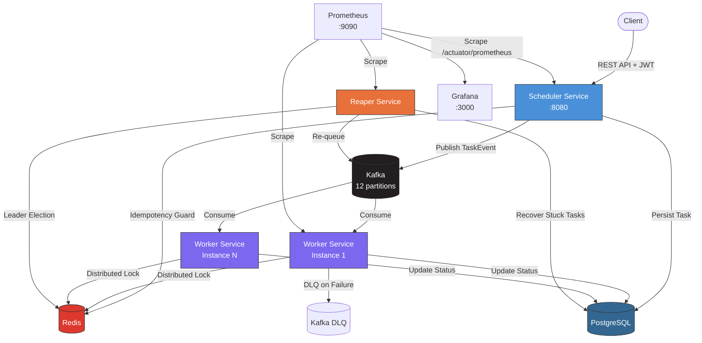

# ⚡ Task Orchestrator

A production-grade **distributed task scheduling and execution system** built with Java 21, Spring Boot 3, Kafka, PostgreSQL, and Redis.

Designed for **effectively-once execution**, horizontal scalability, fault tolerance, and full observability.

---

## Architecture



### Request Flow

```
POST /tasks ──► Rate Limiter ──► JWT/API-Key Auth ──► Idempotency Check (Redis)
     │                                                        │
     │                                            ┌───────────┴───────────┐
     │                                            │ Duplicate?            │
     │                                        YES │                  NO  │
     │                                   Return existing          Persist to DB
     │                                                            Encrypt if PAYMENT
     │                                                            Publish to Kafka
     │                                                            Return 201
     │
     ▼
  Kafka Consumer (Worker) ──► Acquire Redis Lock ──► Execute Task
     │                                                     │
     │                                          ┌──────────┴──────────┐
     │                                          │                     │
     │                                       SUCCESS              FAILURE
     │                                    Update DB: SUCCESS    Retry with backoff
     │                                    Ack offset            or DLQ if exhausted
     │
     ▼
  Reaper (Scheduled) ──► Leader Election ──► Find stuck RUNNING tasks
                                                    │
                                          ┌─────────┴─────────┐
                                          │                   │
                                    Retries left?         Exhausted
                                    Re-queue to Kafka   Mark DEAD + DLQ
```

---

## Modules

| Module | Port | Description |
|--------|------|-------------|
| **common-lib** | — | Shared entities, DTOs, encryption, metrics, audit |
| **scheduler-service** | 8080 | REST API, JWT/API-key auth, rate limiting, Kafka producer |
| **worker-service** | 8081 | Kafka consumer, task execution, retry with backoff, DLQ |
| **reaper-service** | 8082 | Crash recovery, leader election, stuck task re-queuing |

---

## Tech Stack

| Layer | Technology |
|-------|-----------|
| Language | Java 21 |
| Framework | Spring Boot 3.2.5 |
| Messaging | Apache Kafka (KRaft mode) |
| Database | PostgreSQL 16 |
| Cache / Locking | Redis 7 |
| Auth | JWT (JJWT) + API Key |
| Encryption | AES-256-GCM |
| Metrics | Micrometer + Prometheus |
| Dashboards | Grafana |
| Logging | Logstash Logback Encoder (structured JSON) |
| Auto-scaling | KEDA (Kafka lag trigger) |
| Build | Maven multi-module |

---

## Quick Start

### Prerequisites

- Java 21+
- Maven 3.9+
- Docker & Docker Compose

### 1. Start Infrastructure

```bash
cd infra
docker compose up -d
```

This starts **PostgreSQL**, **Redis**, **Kafka**, **Prometheus**, and **Grafana**.

### 2. Build

```bash
mvn clean package -DskipTests
```

### 3. Run Services

In separate terminals:

```bash
# Scheduler (REST API)
java -jar scheduler-service/target/scheduler-service-1.0.0-SNAPSHOT.jar

# Worker (Kafka consumer)
java -jar worker-service/target/worker-service-1.0.0-SNAPSHOT.jar

# Reaper (crash recovery)
java -jar reaper-service/target/reaper-service-1.0.0-SNAPSHOT.jar
```

### 4. Verify

```bash
# Health check
curl http://localhost:8080/actuator/health

# Prometheus metrics
curl http://localhost:8080/actuator/prometheus

# Grafana dashboard
open http://localhost:3000  # admin / admin
```

---

## API Reference

All endpoints require authentication via `Authorization: Bearer <JWT>` or `X-API-Key` header.

### Create Task

```http
POST /tasks
Content-Type: application/json
Authorization: Bearer <jwt>

{
  "idempotencyKey": "order-12345",
  "type": "PAYMENT",
  "payload": "{\"amount\": 99.99, \"currency\": \"USD\"}",
  "scheduledAt": "2026-03-25T00:00:00Z",
  "maxRetries": 5
}
```

**Response** `201 Created`:
```json
{
  "taskId": "a1b2c3d4-...",
  "idempotencyKey": "order-12345",
  "type": "PAYMENT",
  "status": "PENDING",
  "retryCount": 0,
  "maxRetries": 5,
  "createdAt": "2026-03-24T18:30:00Z"
}
```

### Get Task

```http
GET /tasks/{taskId}
Authorization: Bearer <jwt>
```

### List Tasks by Status

```http
GET /tasks?status=PENDING
Authorization: Bearer <jwt>
```

### Cancel Task

```http
DELETE /tasks/{taskId}
Authorization: Bearer <jwt>
```

**Response**: `204 No Content`

### Task Types

| Type | Description | Encrypted? |
|------|-------------|-----------|
| `EMAIL` | Email dispatch | No |
| `PAYMENT` | Payment processing | ✅ AES-256-GCM |
| `REPORT` | Report generation | No |

### Task Status Lifecycle

```
PENDING ──► RUNNING ──► SUCCESS
   │           │
   │           ├──► PENDING (retry with backoff)
   │           │
   │           └──► DEAD (retries exhausted → DLQ)
   │
   └──► DEAD (cancelled)
```

---

## Configuration

### Scheduler Service (`scheduler-service/application.yml`)

| Property | Default | Description |
|----------|---------|-------------|
| `app.security.jwt.secret` | — | Base64 HMAC-SHA256 key |
| `app.security.api-key` | — | Static API key |
| `app.encryption.key` | — | Base64 AES-256 key |
| `app.rate-limit.max-requests` | `100` | Requests per window |
| `app.rate-limit.window-seconds` | `60` | Rate limit window |
| `app.idempotency.ttl-seconds` | `86400` | Idempotency key TTL |
| `app.kafka.topic.partitions` | `12` | Topic partition count |

### Worker Service (`worker-service/application.yml`)

| Property | Default | Description |
|----------|---------|-------------|
| `app.kafka.concurrency` | `6` | Consumer thread count |
| `app.lock.ttl-ms` | `30000` | Distributed lock TTL |
| `app.lock.heartbeat-interval-ms` | `10000` | Lock heartbeat |
| `app.retry.backoff-multiplier` | `5` | Exponential backoff factor |
| `app.retry.initial-delay-ms` | `1000` | First retry delay |
| `app.retry.max-delay-ms` | `600000` | Max retry delay (10min) |
| `app.encryption.key` | — | Must match scheduler key |

### Reaper Service (`reaper-service/application.yml`)

| Property | Default | Description |
|----------|---------|-------------|
| `app.reaper.scan-interval-ms` | `30000` | Scan frequency |
| `app.reaper.heartbeat-threshold-ms` | `60000` | Stuck task threshold |
| `app.reaper.leader-ttl-ms` | `45000` | Leader lock duration |

---

## Observability

### Metrics (Prometheus)

| Metric | Type | Description |
|--------|------|-------------|
| `tasks_created_total` | Counter | Tasks created by type |
| `tasks_completed_total` | Counter | Tasks completed by type/status |
| `tasks_execution_duration_seconds` | Timer | Execution latency by type |
| `tasks_retries_total` | Counter | Retry attempts by type |
| `tasks_dlq_total` | Counter | Dead-lettered tasks |
| `reaper_tasks_recovered_total` | Counter | Reaper recoveries |
| `reaper_tasks_killed_total` | Counter | Reaper kills |

### Structured Logging

All services emit **JSON logs** with MDC context:

```json
{
  "@timestamp": "2026-03-24T18:30:00.000Z",
  "level": "INFO",
  "logger_name": "c.o.w.service.TaskExecutorService",
  "message": "Task completed successfully",
  "service": "worker-service",
  "taskId": "a1b2c3d4-...",
  "taskType": "PAYMENT",
  "workerId": "worker-1",
  "status": "SUCCESS"
}
```

### Audit Trail

Every state transition is recorded in the `audit_log` table:

| Column | Description |
|--------|-------------|
| `task_id` | Task UUID |
| `from_status` | Previous status |
| `to_status` | New status |
| `actor` | Service that made the change |
| `reason` | Human-readable description |
| `timestamp` | When the transition occurred |

---

## Kubernetes Deployment

KEDA auto-scaling manifests are in `infra/k8s/`:

```bash
# Apply manifests
kubectl apply -f infra/k8s/

# Verify KEDA scaling
kubectl get scaledobject worker-scaledobject
```

The worker scales **1 → 10 pods** based on Kafka consumer group lag (threshold: 50 messages).

---

## Security

| Feature | Implementation |
|---------|---------------|
| **Authentication** | JWT (HMAC-SHA256) or static API key |
| **Rate Limiting** | Redis token bucket — 100 req/min per IP |
| **Payload Encryption** | AES-256-GCM for PAYMENT tasks |
| **Idempotency** | Redis + DB unique constraint |
| **Graceful Shutdown** | 30s drain period on SIGTERM |

> ⚠️ **Production**: Replace all default secrets in `application.yml` before deploying.

---

## Project Structure

```
task-orchestrator/
├── common-lib/                  # Shared library
│   └── src/main/java/.../common/
│       ├── audit/               # AuditService
│       ├── dto/                 # TaskRequest, TaskResponse, TaskEvent
│       ├── metrics/             # MetricsService (Micrometer)
│       ├── model/               # TaskEntity, AuditLog, enums
│       ├── repository/          # JPA repositories
│       └── util/                # EncryptionUtil (AES-256-GCM)
├── scheduler-service/           # REST API + Kafka producer
│   └── src/main/java/.../scheduler/
│       ├── config/              # KafkaProducerConfig, KafkaTopicConfig
│       ├── controller/          # TaskController
│       ├── ratelimit/           # RateLimiterService, RateLimitFilter
│       ├── security/            # SecurityConfig, JwtAuthFilter, JwtUtil
│       └── service/             # TaskService
├── worker-service/              # Kafka consumer + executor
│   └── src/main/java/.../worker/
│       ├── config/              # KafkaConsumerConfig
│       ├── consumer/            # TaskConsumer
│       ├── repository/          # WorkerTaskRepository
│       └── service/             # TaskExecutorService
├── reaper-service/              # Crash recovery
│   └── src/main/java/.../reaper/
│       ├── repository/          # ReaperTaskRepository
│       └── service/             # ReaperService
└── infra/
    ├── docker-compose.yml       # Postgres, Redis, Kafka, Prometheus, Grafana
    ├── prometheus.yml           # Scrape config
    └── k8s/                     # Kubernetes + KEDA manifests
        ├── scheduler-deployment.yaml
        ├── worker-deployment.yaml
        └── worker-scaledobject.yaml
```

---

## License

MIT
